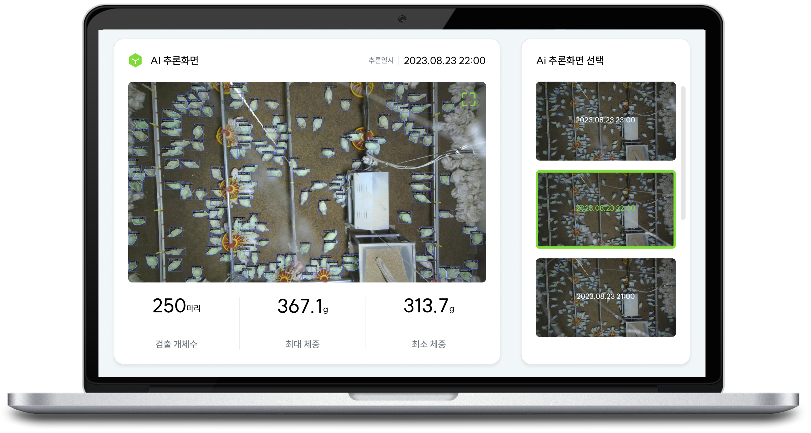
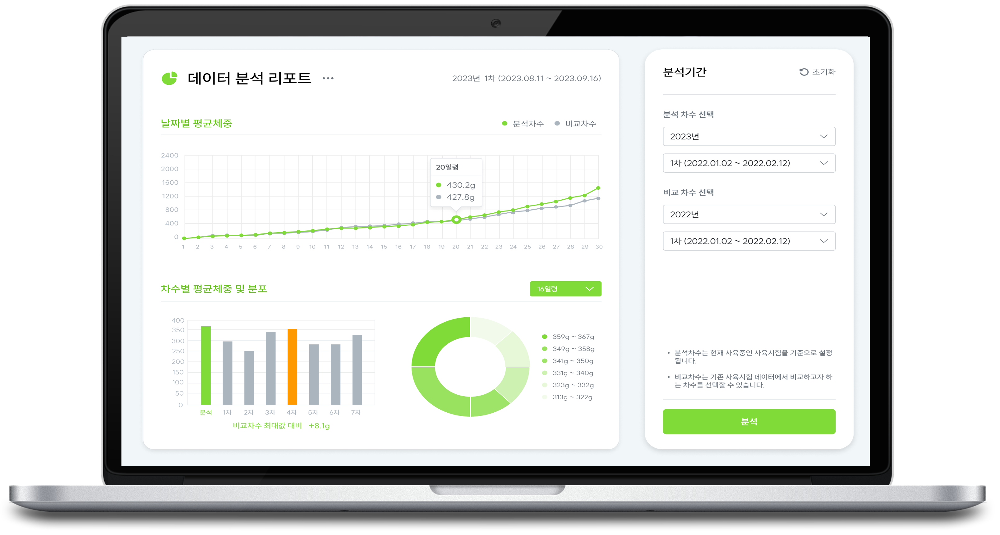
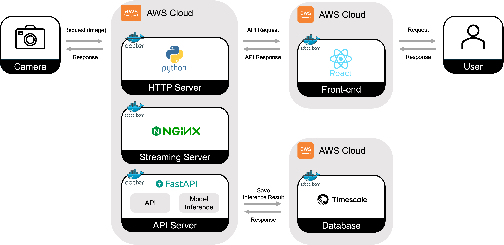
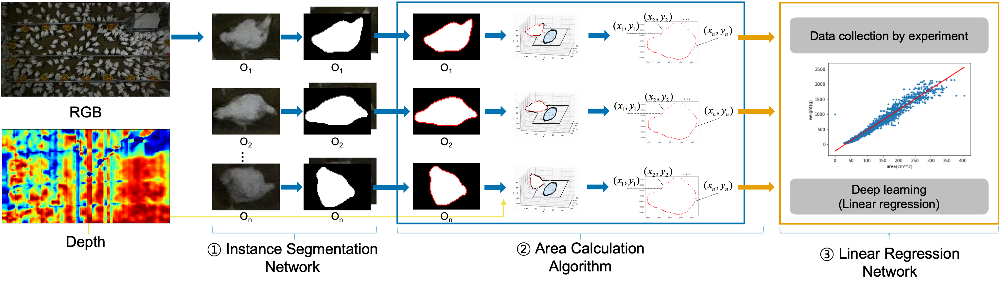

   
  <picture>
    <source srcset="./docs/imgs/nova-vision_logo.png" media="(prefers-color-scheme: dark)">
    
  </picture>
  
  <h2>농장주를 위한 가축 성장관리 서비스</h2>

  

    
    
    
    
    
    
        
    
    
  

 

## 프로젝트 설명

<strong>Nova-Vision</strong>은 이미지만으로 가축의 체중을 측정하여 가축의 성장관리를 도와주는 서비스입니다. 🐓  
3D 카메라로 수집한 이미지로 가축의 체중을 측정하고 성장률을 시각화하여 농장주에게 최적의 출하시기를 알려줍니다.

## 🎯 Technical issues & Resolution process

* [Nova-Vision은 어떻게 개발했을까?: 3D Depth camera 개발](https://dohyeon.tistory.com/73)
* [Nova-Vision은 어떻게 개발했을까?: AI 가축 체중측정 알고리즘 개발](https://dohyeon.tistory.com/95)

## 홍보 영상

    

## 프로젝트 아키텍쳐

### 서비스 아키텍쳐

### 모델 아키텍쳐

## Features

### 실시간 영상 스트리밍 및 캡처

> 실시간 영상 스트리밍과 이미지 캡처를 동시에!

작성중...

 

 

### 카메라 설정값 다운로드

> 수십 대의 카메라 설정을 손쉽게!

작성중...

 

 

### Depth Estimation 

> 오직 두 장의 이미지로 3D 데이터 획득!

작성중...

 

 

### 가축 체중측정

> 이미지만으로 실시간으로 가축 체중측정!

작성중...

 

 

### 가축 성장관리

> 24시간 가축의 성장상태 분석 및 모니터링!

작성중...

 

 
