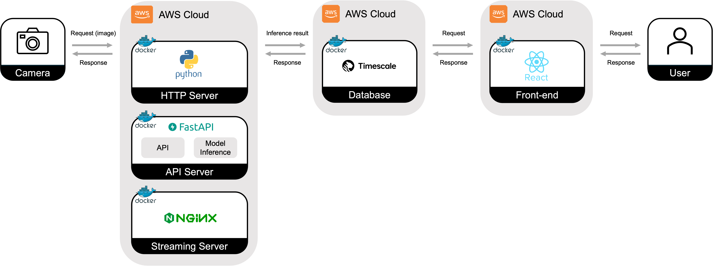

   
  <picture>
    <source srcset="./docs/imgs/nova-vision_logo.png" media="(prefers-color-scheme: dark)">
    
  </picture>
  
  <h2>농장주를 위한 가축 성장관리 서비스</h2>

  

    
    
    
    
    
    
        
    
    
  

 

## 프로젝트 설명

<strong>Nova-Vision</strong>은 이미지만으로 가축의 체중을 예측하여 가축의 성장관리를 도와주는 서비스입니다. 🐓  
3D 카메라로 촬영한 이미지만으로 가축의 체중을 예측하고 농장주에게 시각화해줍니다. 
이미지를 게시하면 분위기, 상황, 날씨를 고려해 어울리는 노래를 추천해줍니다.

## 시연 영상

    

## 프로젝트 아키텍쳐

### 서비스 아키텍쳐

draw.io로 그리는 중입니다...

### 모델 아키텍쳐

